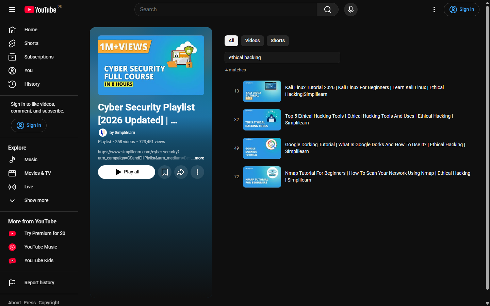

<p align="center">
  
</p>


# YouTube Playlist Search Extension

A lightweight Chromium extension that adds a search bar to any YouTube playlist.

## Features

* Search any playlist, including Watch Later, by title
* Indexes the whole playlist, so every match is reachable, not just the part you scrolled to
* Results show in a virtualized list, so huge playlists cost the same as small ones
* Word order and accents do not matter (`piano concerto` matches *Concerto for Piano*)
* Index is cached for 6 hours
* No API keys. The only permission is `storage`
* Works in Chrome, Edge, Brave, and other Chromium browsers

## Demo

Searching Simplilearn's 358-video Cyber Security playlist for `ethical hacking`.
The whole playlist is indexed up front, so matches show with their original
position (13, 32, 49, 72) even though the page had only rendered 100 rows.



## How it works

Indexing runs in the page's own JavaScript world. That lets it read YouTube's live config data and send requests as the page itself, which is what allows private playlists like Watch Later to index fully.

Search does not hide rows in YouTube's list. YouTube only keeps a few hundred rows on the page at a time, so that approach can never reach matches you have not scrolled to. Instead, matches are drawn from the full index into their own list.

## Repository Structure

```
YT-Playlist-Search/            # root folder
└── YT-Playlist-Search/        # extension files
    ├── icons/
    │   ├── 48x48.png
    │   └── 128x128.png
    ├── manifest.json
    ├── page_bridge.js         # runs in the page's world: indexing
    └── content_script.js      # runs in the extension's world: UI
```

## Installation

1. **Get the code**

   * **Clone with Git** (if you have Git):

     ```bash
     git clone https://github.com/Psi505/YT-Playlist-Search.git
     ```
   * **Or Download ZIP** (no Git needed):

     1. Go to the [YT-Playlist-Search](https://github.com/Psi505/YT-Playlist-Search) repo.
     2. Click **Code** → **Download ZIP** and extract it.

2. **Load the extension in your browser**

   * Open `chrome://extensions/` (or `edge://extensions/`, `brave://extensions/`).
   * Enable **Developer mode**.
   * Click **Load unpacked** and select the `YT-Playlist-Search/YT-Playlist-Search` folder.

That's it. Open YouTube, navigate to any playlist, and enjoy instant search!

> **Tip:** Move the repo folder to a permanent location, such as an `Extensions` folder in your user profile, so you don't lose it when cleaning up your downloads.
